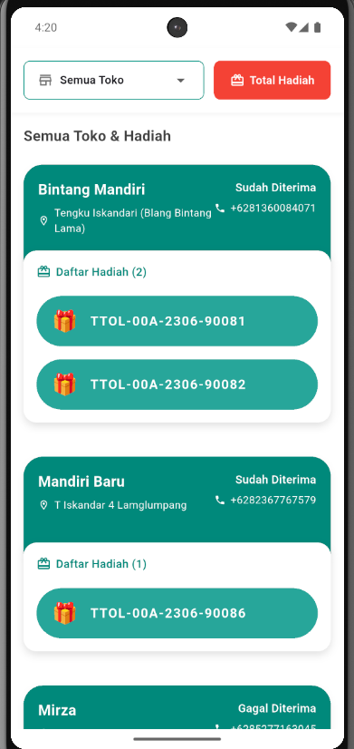
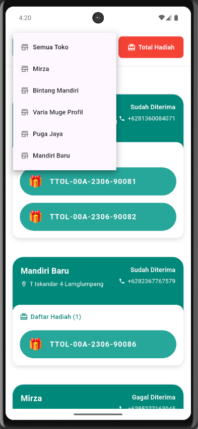
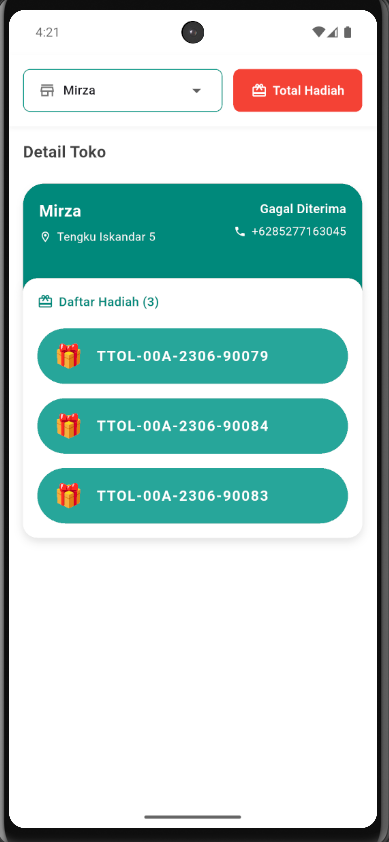
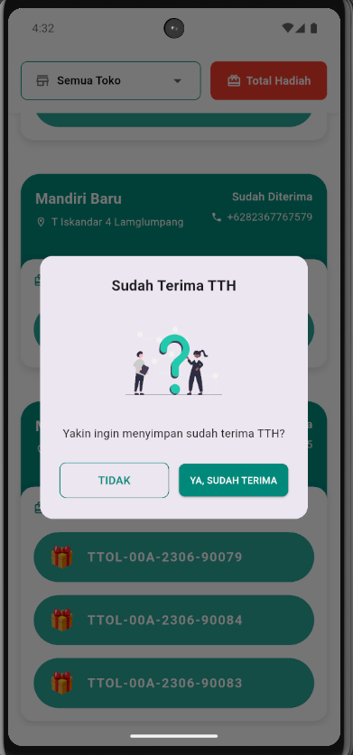
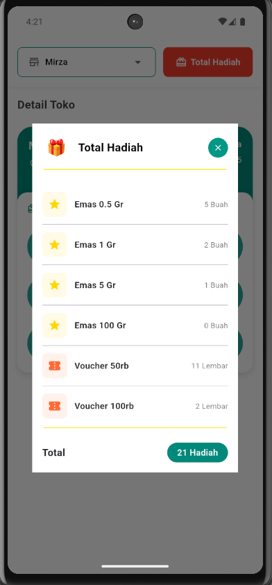
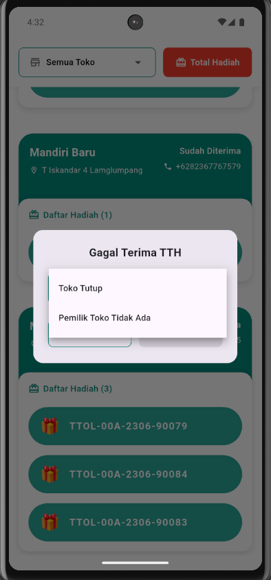

## Screenshots

### Home Screen


### Home Filter Toko


### Detail Toko


### Confirmation Dialog


### Popup Gift


### Rejection Dialog



## Project Structure

```
lib/
├── constants/
│   └── assets.dart           # Asset paths and constants
├── data/
│   ├── datasource/
│   │   └── remote_datasource.dart  # API communication layer
│   └── model/
│       ├── customer.dart     # Customer/Store data models
│       ├── gift_summary.dart # Gift summary models
│       └── confirm_request.dart # API request models
└── pages/
    ├── home.dart            # Main UI implementation
    └── home/
        ├── home_bloc.dart   # Business logic
        ├── home_event.dart  # BLoC events
        └── home_state.dart  # BLoC states
```

## Getting Started

### Prerequisites
- Flutter SDK (latest stable version) At least Flutter 3.30++ because several code is deprecreated
- Dart SDK
- Android Studio / VS Code
- Android emulator

### Installation

1. **Clone the repository**
   ```bash
   git clone <repository-url>
   cd test_tktw
   ```

2. **Install dependencies**
   ```bash
   flutter pub get
   ```

3. **Configure API endpoint**
   Update the base URL in `lib/data/datasource/remote_datasource.dart`:
   ```dart
   baseUrl: 'http://localhost/...'
   ```

4. **Run the application using Emulator Only (Support localhost base url)**
   ```bash
   flutter run
   ```


---

